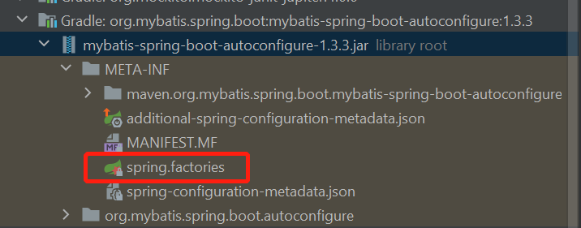
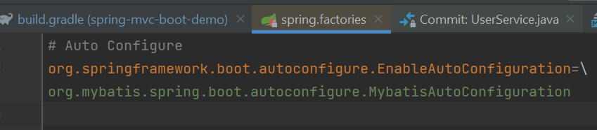
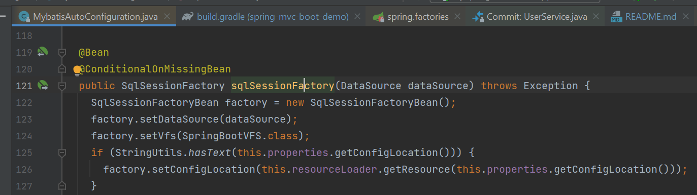

# spring-mvc-boot-demo

## Spring boot AutoConfiguration 原理

由MyBatisAutoConfiguration 深入








而Spring Boot通过 SpringFactoriesLoader

public static final String FACTORIES_RESOURCE_LOCATION = "META-INF/spring.factories";

扫面classPath 当中的所有的jar，如果在resource 中存在 "META-INF/spring.factories" 的话，SpringBoot
将这个配置文件中的Configuration加载并作为可用的Bean维护。
这样以来我们便可以直接autowired 已经配置好的Bean了
```
	private static Map<String, List<String>> loadSpringFactories(ClassLoader classLoader) {
		Map<String, List<String>> result = cache.get(classLoader);
		if (result != null) {
			return result;
		}

		result = new HashMap<>();
		try {
			Enumeration<URL> urls = classLoader.getResources(FACTORIES_RESOURCE_LOCATION);
			while (urls.hasMoreElements()) {
				URL url = urls.nextElement();
				UrlResource resource = new UrlResource(url);
				Properties properties = PropertiesLoaderUtils.loadProperties(resource);
				for (Map.Entry<?, ?> entry : properties.entrySet()) {
					String factoryTypeName = ((String) entry.getKey()).trim();
					String[] factoryImplementationNames =
							StringUtils.commaDelimitedListToStringArray((String) entry.getValue());
					for (String factoryImplementationName : factoryImplementationNames) {
						result.computeIfAbsent(factoryTypeName, key -> new ArrayList<>())
								.add(factoryImplementationName.trim());
					}
				}
			}

			// Replace all lists with unmodifiable lists containing unique elements
			result.replaceAll((factoryType, implementations) -> implementations.stream().distinct()
					.collect(Collectors.collectingAndThen(Collectors.toList(), Collections::unmodifiableList)));
			cache.put(classLoader, result);
		}
		catch (IOException ex) {
			throw new IllegalArgumentException("Unable to load factories from location [" +
					FACTORIES_RESOURCE_LOCATION + "]", ex);
		}
		return result;
	}
```